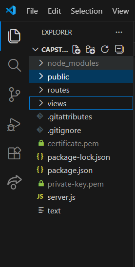

# Capstone Project
`- ClickSafe -`

### Members:
- Euan Fitzpatrick - **Web Developer**
- Rachel Payette - **Web Developer**
- Finn O'Driscoll - **Web Developer**
- Taylor Mathieu - **UX/UI Designer**

## Overview - 
Group project for Capstone class & Showcase in 4th semester at SAIT SADT.
Developing a web app designed to help companies improve internal web security via phishing simulations and gathered campaign data. 
<br> <br>
## Setting up the Server - 

This project uses **Node.js** and **ejs** to manage the environment.

### Prerequisites:
- **Node.JS**  - (Version 11 or higher)
<br>```https://nodejs.org/en/download```
<br><br>
- **ejs** - (version 11 or higher)
<br>in your command terminal, run 
<br>```npm install ejs```
---
 Please follow these directions in order to configure the server as intended. If you encounter any issues, please reach out to the dev team via rachel.payette@edu.sait.ca .

### Steps:

1. Clone the Capstone Github Repository 
<br>```https://github.com/EuanFitz/capstone/tree/server-side```
<br> <br>
2. Open the repository clone in your **code editor** (*like VS Code*)
<br> <br>
3. in your commandline or cmd terminal, install the following dependancies:
    - **express.js** 
    <br>```npm install express https fs hsts```
    - **OpenSSL** (install via manager like Homebrew, Winget, or chocolatey ) example for homebrew: 
    <br>```brew install openssl```
    <br> <br>
4. Generate a private key
<br>```openssl genrsa -out private-key.pem 2048```
<br> <br>
5. Generate a certificate
<br>```openssl req -new -x509 -key private-key.pem -out certificate.pem -days 365```
<br> <br>
6. In the **Capstone** directory, ensure your private-key and certificate are saved as **private-key.pem** and **certificate.pem** respectively, and are *not located in any sub-folders in the capstone directory*


<br> <br>

7. In your commandline/cmd terminal in your code editor, run the command
<br>```npm run dev``` 
<br>to launch the server

<br> <br>
## SSL Configuration Guide -
<br>

### Security Header Breakdown 

| Security Header      | Custom or default | Reasoning     |
| :---        |    :----:   |          ---: |
| Content-Security-Policy (CSP)      | Default       | Used “CSPevaluator.com” due to recommendation in Helmet documentation. CSP eval site recommended adding a “require trusted types” directive for scripts. We implemented this change at first, but later discovered it was not relevent and did not work well with browsers other than Chrome, so we **reverted to default**.   |
| Cross-Origin-Embedder-Policy (COEP)   | Default        | we intend to pull from an llm API to generate text for an email template feature down the line, so this security header was not set to allow cross-origin-embedding from that API.      |
| Cross-Origin-Opener-Policy   | Default        | Maintained “same-origin” so Browser Context Groups (new tabs/popups/dialogues) are only allowed to open if they are from the same origin.      |
| Cross-Origin-Resource-Policy  | Default        | Maintained “same-origin” as we only want to load resources from our origin.      |
| Origin-Agent-Cluster   | Default        | Maintained the default value of “?1” (true) as we don’t have any cousin sites, only clicksafe.com. All  communications between different pages will be from the same origin.      |
| Referrer-Policy   | Default        | No changes needed as we are not embedding content on any of our pages; We may revisit this based on architecture changes down the road.      |
| Strict-Transport-Security   | Custom       |  Due to the sensitive nature of the data on the site, HTTPS is the only reasonable option for us to use. We manually **set the STS preload boolean to true** as this header’s status is not standard across browsers, but ensures the connection to domain is a secure.      |
| X-Content-Type-Options   | Default        | maintaining the default state (**Enabled**) to prevent browsers from MIME type sniffing. There are security concerns as some MIME types represent as executable content.      |
| X-DNS-Prefetch-Control   | Default        | Maintaining the default value (**Disabled**) to improve loading times. When this header is disabled, the domain name will resolve in parallel with the page content. When this header is enabled, the domain name will be required to resolve before the page content.      |
| X-Download-Options   | Default        | We will not facilitate any unsafe downloads on our site. The user will be prevented from opening a file download directly and instead save the file locally. Disabling the execution of unsafe  downloads on the site = less risk of script injection/ MITM attacks.      |
| X-Frame-Options   | Default        | Maintaining default setting. Due to nature of site and content, embedding cannot be allowed to prevent cross-site leaks or clickjacking.     |
| X-Permitted-Cross-Domain-Policies  | Defualt    | This prevents Adobe flash (depreciated, less of an issue) and acrobat from loading data from the ClickSafe domain. Our site will only be inporting/exporing csv data, so disabling adobe from requesting cross-domain policy files can prevent potential information leakage.       |
| X-Powered-By   | Default        | Helmet removes this security header by default. “X powered by” would normally show what tech-stack we are using, which give bad actors 3.	unnecessary opportunities to find vulnerabilities within our setup/server/code/hosting etc.  We will allow helmet to **disable this entirely**.      |
| X-XSS-Protection   | Default        | This is a depreciated directive and is set, by default, to zero. It has depreciated and is no longer in use by modern sites. We are keeping this **set to zero** to disable X-XSS filtering.      |


### Certificate Setup
As the ClickSafe project does not currently have an official domain or hosting, we are unable to use recognized and trusted *Certificate Authorities* (CA) like **CertBot** and **Let's Encrypt**. 
Due to this, the current developer environement is limited to local hosting using self-approved certificates via **OpenlSSL**.

The steps required to create your own certificate were covered in steps **4** & **5** in the ***"Setting up the Server"*** section. 


<br> <br>
## Caching Strategies - 

### Developed Routes:

- Landing page
```/```
- Admin Login
```/admin```
- User login
```/user```
- FAQ page
````/faq````
- Admin Dashboard Page
```/dashboard```


### Caching Policies

| Caching Policy      | Reasoning |
| ----------- | ----------- |
| Static Caching    | Set in **server.js:35**, this ensures all css docs and image types located in the public folder are cached based on filetype.  Css files are cached for 24 hours to improve page load times and reduce server load. Image types (with the extensions of .png, .jpg, and .ico)  are cached for 30 days to reduce server load and to have browsers reuse previously downloaded images instead of fetching them again.  |
| Dynamic Caching   | Set up in **server.js:81**,  This affects the items within const graph. These are set to revalidate every minute and have a max-age of 5 minutes. This was done as these images are placeholders for what will bcome live and active graphs, created based on db data relating to user interaction with phishing simulation. As these will later be considerd "live" or close to live, we wanted to get used to fast refreshing and caching standards.       |


*Reasoning/Summary*: 
<br>
***Static*** and relatively unchanging elements such as CSS and images were set with caching parameters based on their importance and likelihood to change. 

***Dynamic***  and *live* elements, like the future data-representational visualization aids (graphs) need to be cached and refreshed frequently. the timing used in our file (1 minute and 5 minutes) will likley be adjusted when the actual elements are developed. This code, like the placeholder static graph images, will be changed as the project developes. 

---
## Lessons Learned - 

Reflect on any challenges you faced and the solutions you applied.


